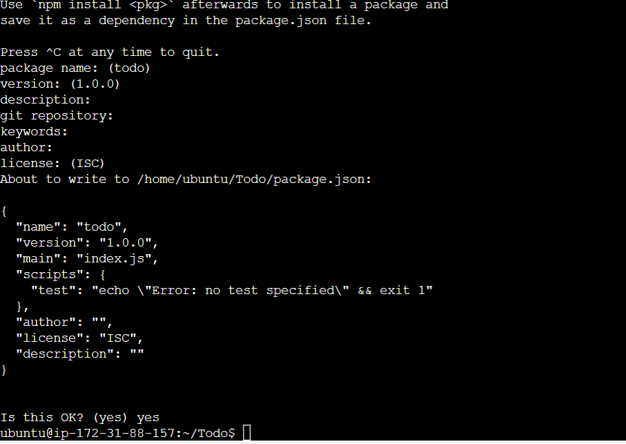

# MERN STACK Implementation

## Update and Upgrade new Instance

`sudo apt update`
`sudo apt upgrade`

## NODE.JS install

`curl -fsSL https://deb.nodesource.com/setup_18.x | sudo -E bash -`

## NODE.JS update

`sudo apt-get install -y nodejs`

## Application of code-initial

`mkdir Todo`
`ls`
`cd Todo`
`npm init`
-Click Enter and some other times
-Type Yes

## Express Js install

`npm install express`

## create file index

`touch index.js`

## Install dotenv

`npm install dotenv`

## Edit index file

`vim index.js`

>const express = require('express');
require('dotenv').config();

const app = express();

const port = process.env.PORT || 5000;

app.use((req, res, next) => {
res.header("Access-Control-Allow-Origin", "\*");
res.header("Access-Control-Allow-Headers", "Origin, X-Requested-With, Content-Type, Accept");
next();
});

app.use((req, res, next) => {
res.send('Welcome to Express');
});

app.listen(port, () => {
console.log(`Server running on port ${port}`)
});

### to save

-type :w ,ENTER
-and :qa ,ENTER to exit vim

## Check port in terminal

-Open Terminal
-`cd Todo`
-`node index.js`

## Add inbound rule for

-Custom TCP
-Port 5000
-Description "Port 5000 for Project MERN "To-do" application deployment"

## View in browse

[http://3.92.213.228:5000]

## Routes

There are three actions that our To-Do application needs to be able to do:
1. Create a new task
2. Display list of all tasks
3. Delete a completed task

## Blocker unable to connect to instance

- Created another inbound rule for ssh port 80
- Set inbound for HTTP on port 80
-set for inbound for ssh on port 22

## create route direction and set to it

`mkdir routes`
`cd routes`
`touch api.js`

## Insert into api.js

`vim api.js`
>const express = require ('express');
const router = express.Router();

router.get('/todos', (req, res, next) => {

});

router.post('/todos', (req, res, next) => {

});

router.delete('/todos/:id', (req, res, next) => {

})

module.exports = router;

[]save with
:w ENTER and
:qa ENTER

## Create Models Directory

`cd Todo`

## Install Mongoose

`npm install mongoose`

## Create Models Directory

`mkdir models`
`mkdir models && cd models && touch todo.js`
`vim todo.js`

## insert into todo.js

>const mongoose = require('mongoose');
const Schema = mongoose.Schema;

//create schema for todo
const TodoSchema = new Schema({
action: {
type: String,
required: [true, 'The todo text field is required']
}
})

//create model for todo
const Todo = mongoose.model('todo', TodoSchema);

module.exports = Todo;

**save with**

:w ENTER
:qa ENTER

## Change directory from Todo to Routes

` cd ..`
`cd routes`
`vim api.js
-Delete contents with :%d ENTER
-update with

>const express = require ('express');
const router = express.Router();
const Todo = require('../models/todo');

router.get('/todos', (req, res, next) => {

//this will return all the data, exposing only the id and action field to the client
Todo.find({}, 'action')
.then(data => res.json(data))
.catch(next)
});

router.post('/todos', (req, res, next) => {
if(req.body.action){
Todo.create(req.body)
.then(data => res.json(data))
.catch(next)
}else {
res.json({
error: "The input field is empty"
})
}
});

router.delete('/todos/:id', (req, res, next) => {
Todo.findOneAndDelete({"_id": req.params.id})
.then(data => res.json(data))
.catch(next)
})

module.exports = router;

## MOBAXTERM New session

- Download and Install MobaXterm Home edition
- New SSH session
- Copy IP address
- Username
- Specify Primary Key (pick from download folder)

## Backend Configuration

`sudo apt update`
`sudo apt upgrade`

## Location of Node.JS

`curl -sL https://deb.nodesource.com/setup_12.x | sudo -E bash -`
